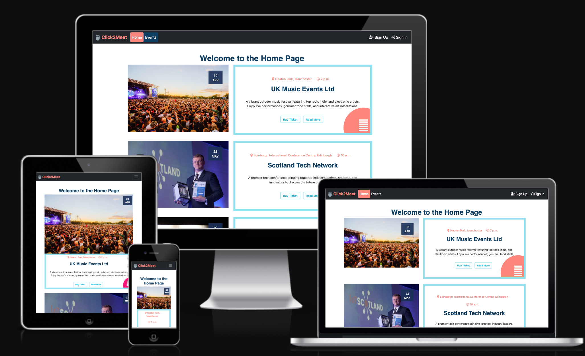
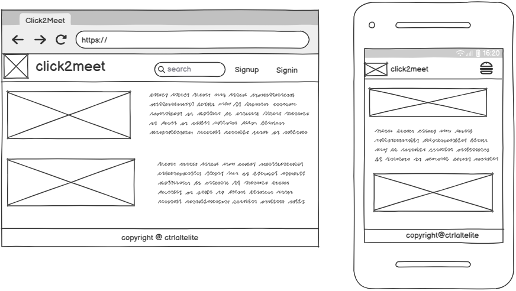
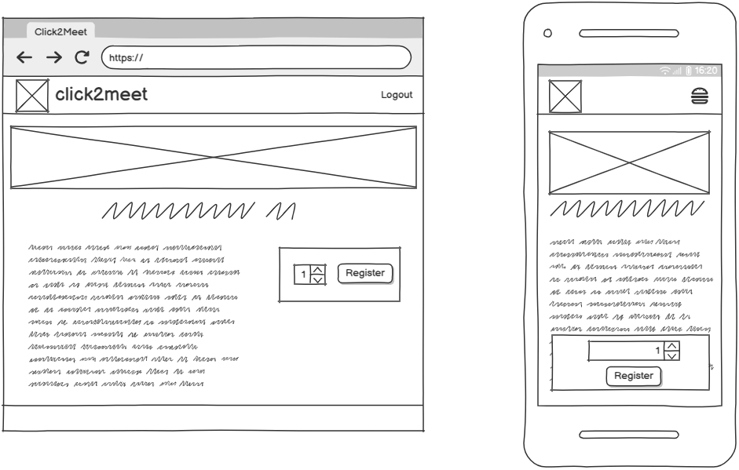
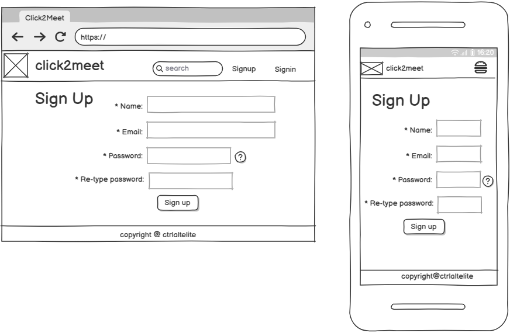
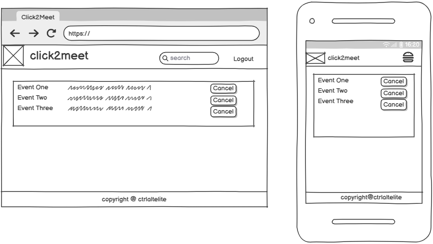
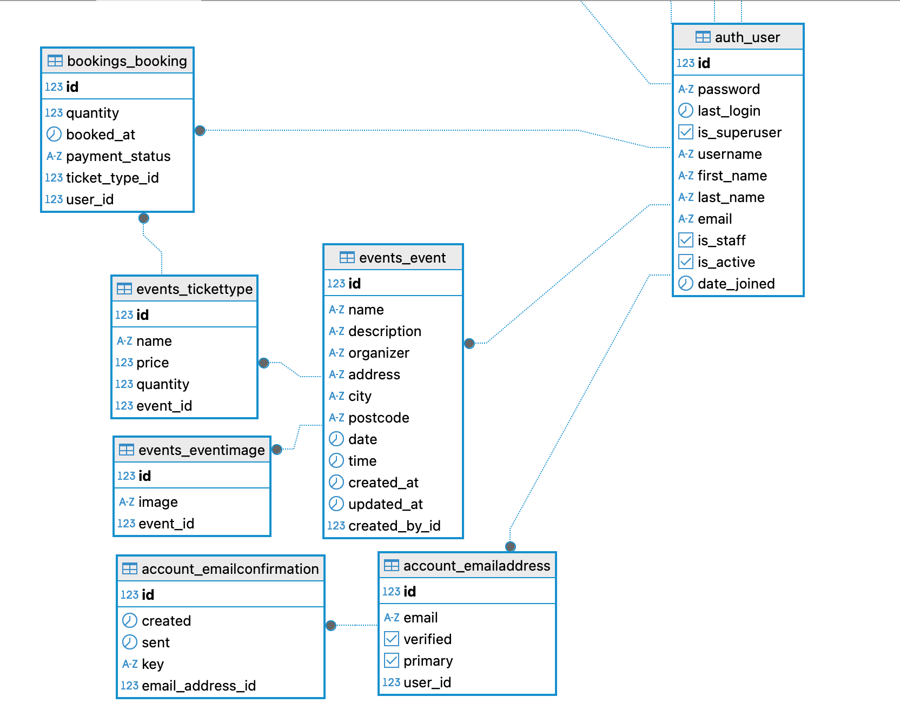

# click2meet

## Introduction

click2meet is a Django-based web application for users to book and manage event tickets. Users can create, view, and cancel bookings for various events.



[UI Responsive Link](https://ui.dev/amiresponsive?url=https://click2meet-4e32aa494605.herokuapp.com/)

Visit the live site here: [click2meet](https://click2meet-4e32aa494605.herokuapp.com/)

## Table of Contents

- [click2meet](#click2meet)
  - [Introduction](#introduction)
  - [Table of Contents](#table-of-contents)
  - [Overview](#overview)
- [UX - User Experience](#ux---user-experience)
  - [Colour Scheme](#colour-scheme)
  - [Font](#font)
- [Project Planning](#project-planning)
  - [Agile Methodologies - Project Management](#agile-methodologies---project-management)
    - [MoSCoW Prioritization](#moscow-prioritization)
    - [Kanban Board](#kanban-board)
  - [User Stories](#user-stories)
  - [Skeleton](#skeleton)
    - [Wireframes](#wireframes)
    - [Database Schema - Entity Relationship Diagram](#database-schema---entity-relationship-diagram)
- [Features](#features)
  - [User View - Registered/Unregistered](#user-view---registeredunregistered)
  - [Feature Showcase](#feature-showcase)
  - [Future Features](#future-features)
- [Technologies & Languages Used](#technologies--languages-used)
  - [Libraries & Frameworks](#libraries--frameworks)
  - [Tools & Programs](#tools--programs)
- [Testing](#testing)
- [Deployment](#deployment)
  - [Heroku Deployment](#heroku-deployment)
  - [Local Deployment](#local-deployment)
  - [Clone Project](#clone-project)
  - [Fork Project](#fork-project)
- [AI Implementation and Orchestration](#ai-implementation-and-orchestration)
  - [Use Cases and Reflections](#use-cases-and-reflections)
  - [Code Creation](#code-creation)
  - [Debugging](#debugging)
  - [Performance and UX Optimization](#performance-and-ux-optimization)
  - [Overall Impact](#overall-impact)
- [Credits](#credits)
  - [Code](#code)
  - [Media](#media)
  - [The Team](#the-team)

## Overview

click2meet is a platform designed for users to book and manage event tickets. The platform offers the following features:

- Logged-in users can:
  - View event details
  - View their bookings
  - Create bookings
  - Cancel bookings
- Unregistered users can:
  - View available events

# UX - User Experience

## Colour Scheme

The color scheme for click2meet is designed to be visually appealing and user-friendly. The chosen colors are:


## Font

The fonts used for click2meet are chosen to enhance readability and aesthetics. The chosen fonts are:

# Project Planning

## Agile Methodologies - Project Management

We have used our GitHub project board to manage the project. We have created a project board with columns for each stage of the project. We have created issues for each task and assigned them to the relevant column. We have also used the project board to track the progress of the project.

### MoSCoW Prioritization

- **Must Have:** User authentication, booking creation, viewing bookings, canceling bookings.
- **Should Have:** User profiles, search functionality.
- **Could Have:** Purchase tickets.

### Kanban Board

The Kanban board used for this project is a GitHub project board with the following columns:

- **To Do:** Tasks that need to be done.
- **In Progress:** Tasks that are currently being worked on.
- **Done:** Tasks that are completed and tested.

You can view the project board [here](https://github.com/users/catrinlam/projects/7).

## User Stories

User stories are managed in the GitHub project board. We have created issues for each user story and assigned them to the relevant column.

Link to User Stories in GitHub Projects: [GitHub Projects Kanban Board](https://github.com/users/catrinlam/projects/7)

## Skeleton

### Wireframes

The wireframes for click2meet were created using Balsamiq. They include views for desktop, tablet, and mobile devices to ensure a responsive design.

- **Home Page**
  - The home page provides an overview of the platform and its features.
  

- **Event Details Page**
  - The event details page displays individual events with details and user interactions.
  

- **Sign Up Page**
  - The sign-up page allows new users to create an account on the platform.
  

- **Booking List Page**
  - The booking list page shows the bookings created by the user.
  

### Database Schema - Entity Relationship Diagram

The database schema for click2meet was created using dbdiagram.io. It includes tables for users, events, bookings, and comments.



# Features

## User View - Registered/Unregistered

| Page                  | Unregistered Users | Logged-in Users |
|-----------------------|--------------------|-----------------|
| Home Page             | Visible            | Visible         |
| Event Details Page            | Visible            | Visible         |
| Booking List Page     | Not Visible        | Visible         |

## Feature Showcase

<details>
    <summary>Header: Provides navigation links to different sections of the site.</summary>  
      
</details>

<details>
    <summary>Footer: Provides additional information and links.</summary>  
      
</details>
<details>
    <summary>Home Page: Provides an overview of the platform and its features.</summary>  
      
</details>

<details>
    <summary>Event Details Page: Displays individual events with details and user interactions.</summary>  
      
</details>

<details>
    <summary>Booking List Page: Shows the bookings created by the user.</summary>  
      
</details>

## Future Features

- **More Event Details:** Allow users to upload different event details.
- **Buying Tickets:** Enable users to purchase their tickets for some events.

# Technologies & Languages Used

## Libraries & Frameworks

- **HTML**
- **CSS**
- **JavaScript**
- **Python**
- **Django**

## Tools & Programs

- **Cloudinary:** Used for cloud media storage for images.
- **Git:** Used for version control.
- **GitHub:** Used for online storage of codebase and Projects tool.
- **Heroku:** Used to host the website.
- **Balsamiq:** Used for creating wireframes.

# Testing

Please refer to [TESTING.md](TESTING.md) for all testing.

# Deployment

The live deployed application can be found deployed on [here](https://click2meet-4e32aa494605.herokuapp.com/).


## Heroku Deployment

This project uses [Heroku](https://www.heroku.com), a platform as a service (PaaS) that enables developers to build, run, and operate applications entirely in the cloud.

Deployment steps are as follows, after account setup:

- Select **New** in the top-right corner of your Heroku Dashboard, and select **Create new app** from the dropdown menu.
- Your app name must be unique, and then choose a region closest to you, and finally, select **Create App**.
- From the new app **Settings**, click **Reveal Config Vars**, and set your environment variables.

> [!IMPORTANT]  
> This is a sample only; you would replace the values with your own if cloning/forking our repository.

| Key | Value |
| --- | --- |
| `DATABASE_URL` | user's own value |
| `SECRET_KEY` | user's own value |
| `CLOUDINARY_URL` | user's own value |
| `DISABLE_COLLECTSTATIC` | 1 (*this is temporary, and can be removed for the final deployment*) |

Heroku needs three additional files in order to deploy properly.

- requirements.txt
- Procfile
- .python-version

You can install this project's **requirements** (where applicable) using:

- `pip3 install -r requirements.txt`

If you have your own packages that have been installed, then the requirements file needs updated using:

- `pip3 freeze --local > requirements.txt`

In Heroku, you need to select your own GitHub repository and click the `Deploy` button.

The project should now be connected and deployed to Heroku!

## Local Deployment

This project can be cloned or forked in order to make a local copy on your own system.

For either method, you will need to install any applicable packages found within the *requirements.txt* file.

- `pip3 install -r requirements.txt`.

You will need to create a new file called `env.py` at the root-level, and include the same environment variables listed above from the Heroku deployment steps.

> [!IMPORTANT]  
> This is a sample only; you would replace the values with your own if cloning/forking our repository.

Sample `env.py` file:

```python
import os

os.environ.setdefault("DATABASE_URL", "<user's own value>")
os.environ.setdefault("SECRET_KEY", "<user's own value>")

# local environment only (do not include these in production/deployment!)
os.environ.setdefault("DEBUG", "True")
```

## Clone Project

You can clone the repository by following these steps:

1. Go to the [GitHub repository](https://github.com/catie/click2meet)
2. Locate the Code button above the list of files and click it
3. Select if you prefer to clone using HTTPS, SSH, or GitHub CLI and click the copy button to copy the URL to your clipboard
4. Open Git Bash or Terminal
5. Change the current working directory to the one where you want the cloned directory
6. In your IDE Terminal, type the following command to clone our repository:
   - `git clone https://github.com/catie/click2meet.git`
7. Press Enter to create your local clone.

## Fork Project

By forking the GitHub Repository, we make a copy of the original repository on our GitHub account to view and/or make changes without affecting the original owner's repository.
You can fork this repository by using the following steps:

1. Log in to GitHub and locate the [GitHub Repository](https://github.com/catrinlam/click2meet)
2. At the top of the Repository (not top of page) just above the "Settings" Button on the menu, locate the "Fork" Button.
3. Once clicked, you should now have a copy of the original repository in your own GitHub account

# AI Implementation and Orchestration

## Use Cases and Reflections
Throughout the development of click2meet, GitHub Copilot was integrated into the workflow to assist with various aspects of coding, debugging, and optimisation. This project marked a significant step in leveraging AI-powered development tools to enhance efficiency and maintain code quality.

## Code Creation

**Reflection:** 
## Debugging

**Reflection:** 

## Performance and UX Optimization

**Reflection:** 

## Overall Impact


# Credits

## Code

- Readme structure from [project readme guide](https://github.com/Code-Institute-Org/html-css-project/blob/main/sample-full-stack-capstone-readme.md#ai-implementation-and-orchestration)

## Media

- 

| Source | Author | Link |
|--------|--------|------|


## The Team

[Linda Collins](https://github.com/lindanwajei2205)

[Lionel Gweshe](https://github.com/Leo-gwe)

[Sardar Amiri](https://github.com/SardarAmiri)

[Catrin Lam](https://github.com/catrinlam)