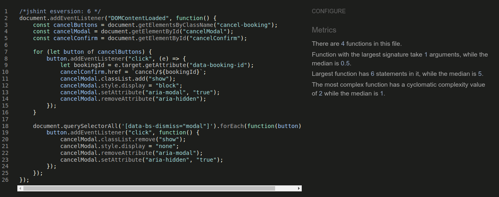

# Testing

This is the TESTING file for the [click2meet](https://click2meet-4e32aa494605.herokuapp.com/) website.

Return back to the [README.md](README.md) file.

## Testing Contents  
  
- [Testing](#testing)
  - [Testing Contents](#testing-contents)
  - [Validation](#validation)
    - [HTML Validation](#html-validation)
    - [JavaScript Validation](#javascript-validation)
    - [Python Validation](#python-validation)
    - [CSS Validation](#css-validation)
    - [Lighthouse Scores](#lighthouse-scores)
    - [Wave Accessibility Evaluation](#wave-accessibility-evaluation)
  - [Unit Testing](#unit-testing)
  - [Manual Testing](#manual-testing)
    - [User Input/Form Validation](#user-inputform-validation)
    - [Testing User Stories](#testing-user-stories)
  - [Bugs](#bugs)

## Validation

### HTML Validation

[HTML validation](https://validator.w3.org/nu/?doc=https%3A%2F%2Fstitchin-aa280977732a.herokuapp.com%2F)

| HTML Source Code/Page | Errors | Warnings | Note                             |
| --------------------- | ------ | -------- | -------------------------------- |
| Home                  | 0      | 0        |                                  |
| Sign In               | 0      | 0        |                                  |
| [Sign Up](docs/testing/html_signup.png)               | 1      | 0        | Error based on built-in Django form       |
| Pattern Detail        | 0      | 0        |                                  |
| Post Pattern          | 0      | 0        |                                  |
| Delete Comment        | 0      | 0        | |
| View Favourites       | 0      | 0        |                                  |
| Log Out               | 0      | 0        |                                  |
| Forgot Password       | 0      | 0        | 

### JavaScript Validation

[JSHint](https://jshint.com/) was used to validate the small amount of JavaScript code added to the project.

| File          | Screenshot | Notes |
|---------------|------------|-------|
| scripts.js |  | No errors found |

**Note:** The `/*jshint esversion: 6 */` directive was added to the top of the JavaScript files to specify the ECMAScript version.

### Python Validation

[CI Python Linter](https://pep8ci.herokuapp.com/#) was used to validate the Python files.

| File       | Screenshot | Notes |
|------------|------------|-------|
| admin.py   |  | No errors found |
| forms.py   |  | No errors found |
| models.py  |  | No errors found |
| urls.py    |  | No errors found |
| views.py   |  | No errors found |

### CSS Validation 

[W3C CSS Validator](https://jigsaw.w3.org/css-validator/) was used to validate my CSS file.

  

 
   
### Lighthouse Scores

Lighthouse testing was carried out in Incognito mode to achieve the best result.

**Desktop**  

  
*Desktop Home Page*  
  
  
*Desktop Event Details Page*

**Mobile**  

 
*Mobile Home Page*  
  
 
*Mobile Event Details Page*
  

  

### Wave Accessibility Evaluation

[Wave Accessibility Evaluation](https://wave.webaim.org/) was used to check the accessibility of the page.

  

  

## Manual Testing

### Testing User Stories

User Stories are documented in the [Stitchin GitHub Projects Board](https://github.com/users/catrinlam/projects/6).

| User Story                                                                                               | Met Acceptance Criteria                                                                 | Response                                                                                 | Pass/Fail | Fix |
|----------------------------------------------------------------------------------------------------------|------------------------------------------------------------------------------------------|------------------------------------------------------------------------------------------|-----------|-----|

  
## Bugs  
  

